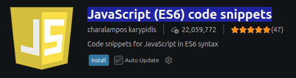
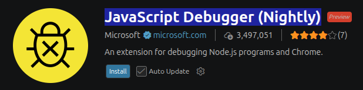
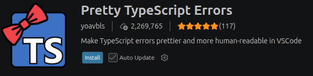
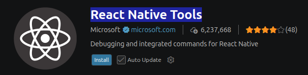
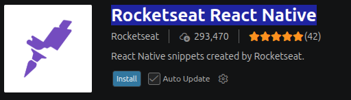
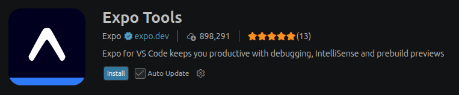
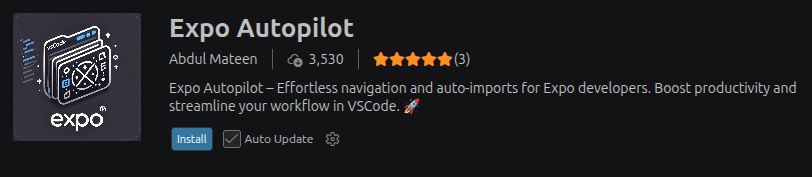

# Extensiones de VSCODE para PGL

## Lista de extensiones:

### Extensiones para JavaScript:

JavaScript (ES6) code snippets: Su objetivo principal es acelerar la escritura de código JavaScript o TypeScript mediante el uso de abreviaturas (clg --> console.log()).

JavaScript Debugger (Nightly): Su objetivo es acelerar el proceso de encontrar y corregir errores dentro del código de JavaScript, además de mejoras de rendimiento cada noche directamente desde su repositorio de desarrollo.

----

### Extensiones para TypeScript:

JavaScript (ES6) code snippets: Su objetivo es acelerar la escritura de código JavaScript o TypeScript mediante el uso de abreviaturas (clg --> console.log()).

Pretty TypeScript Errors: Es una herramienta de productividad visual diseñada para solucionar los mensajes de error de typescript, haciendo a estos mas limpios y formateados, además de añadirles color.

----

### Extensiones para React y React Native: 

React Native Tools: es un entorno de desarrollo integrado para Visual Studio Code diseñado específicamente para agilizar la creación, ejecución y depuración de aplicaciones móviles creadas con React y React Native.

Rocket Seat React Native: esta herramienta fue diseñada específicamente para acelerar el desarrollo en dispositivos móviles, permitiendo estructurar componentes enteros de React y React Native, y archivos de configuración con solo escribir unas pocas letras.

----

### Extensiones para Expo:

Expo Tools: su objetivo es automatizar la configuración y simplificar la depuración de tus aplicaciones móviles con React Native directamente desde Visual Studio Code.

Expo Autopilot: su objetivo es automatizar la organización de archivos y gestionar de forma inteligente las importaciones en proyectos móviles para ahorrar tiempo en desarrollo.

---

