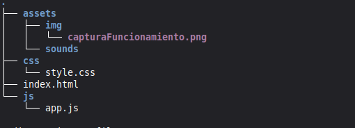
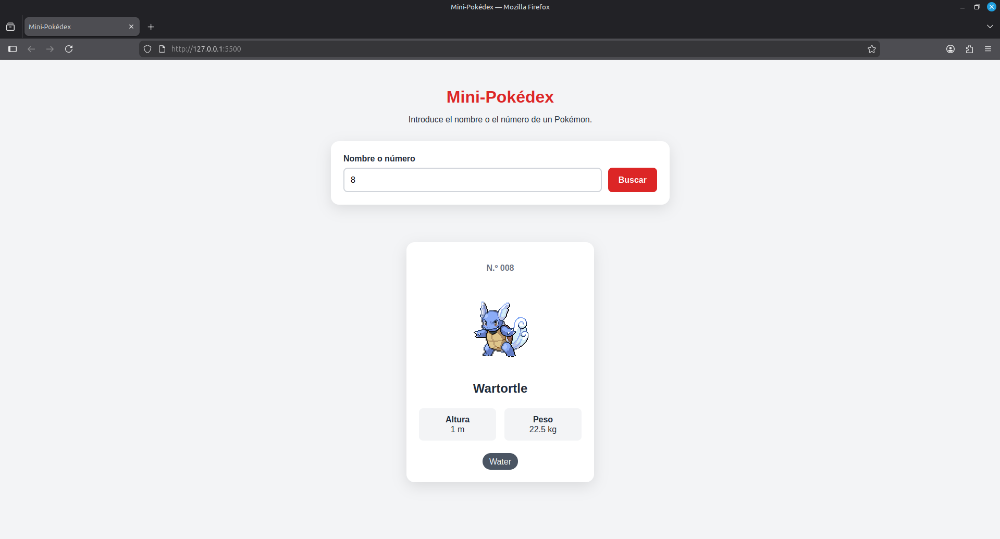
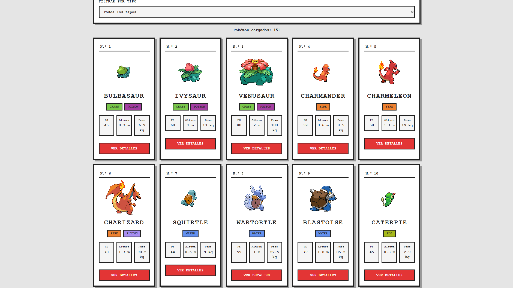
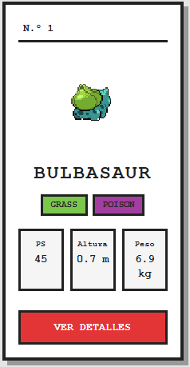
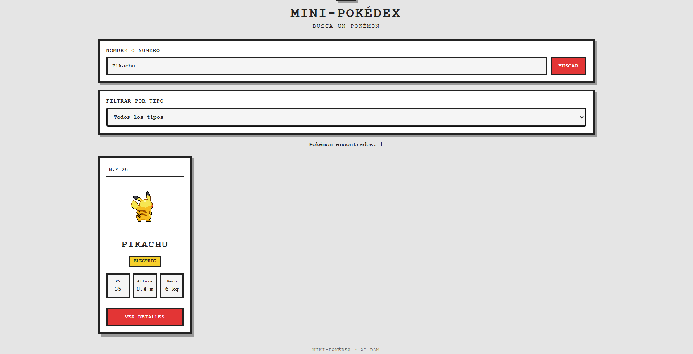
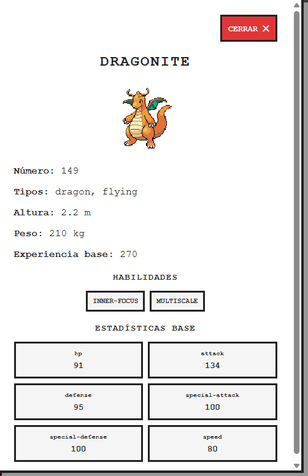
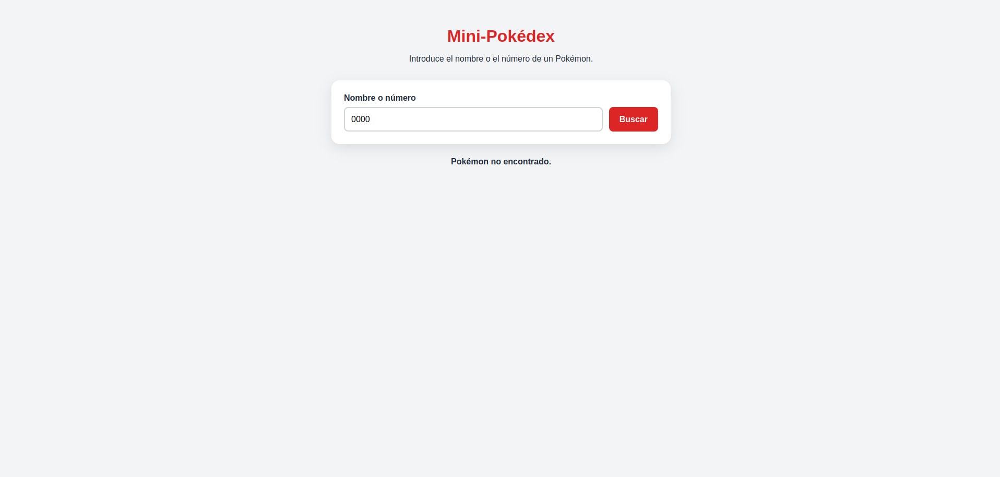
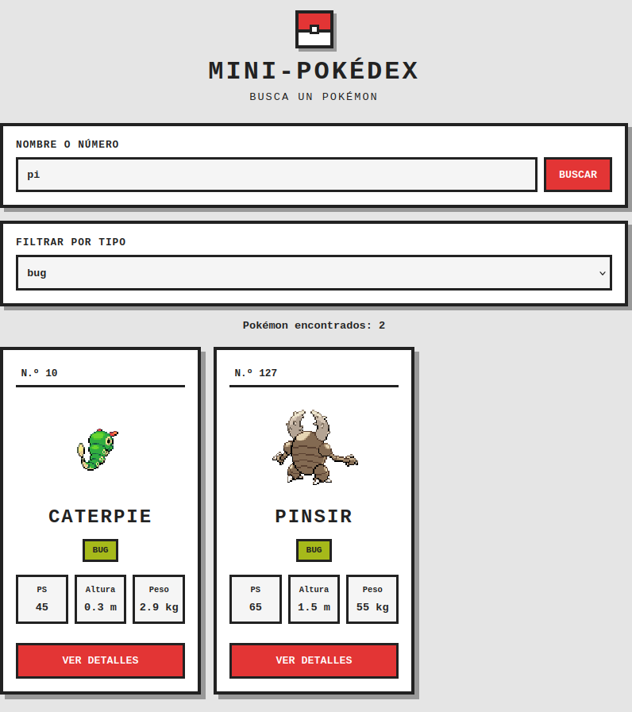

# Actividad final: desarrollo de una Pokédex con JavaScript

En esta actividad hemos ampliado la mini-Pokédex desarrollada en la guía de la práctica Pre-pokédex hasta convertirla en una Pokédex más completa.

La aplicación consulta información real de Pokémon mediante PokéAPI y genera su contenido dinámicamente con JavaScript.

---

## 1. Punto de partida

Primeramente, desarrollamos una mini-Pokédex que sirve como base para realizar una versión mejorada.

La mini-Pokédex inicial tiene las siguientes funcionalidades:

* Una barra de búsqueda en la que podemos introducir el nombre o número de un Pokémon.
* Una tarjeta con el número, nombre, peso, altura y tipo del Pokémon.
* Conexión a PokéAPI para obtener información real.
* Visualización dinámica de los datos obtenidos.
* Gestión básica de errores cuando no se encuentra un Pokémon.

### Estructura inicial de carpetas y archivos



### Aplicación funcionando y búsqueda



---

## Avanzando en el Proyecto:

### Código utilizado para obtener un Pokémon

Una de las funciones principales de la mini-Pokédex es `obtenerPokemon`, que realiza una petición a PokéAPI:

```js
const obtenerPokemon = async (busqueda) => {
  const url = `https://pokeapi.co/api/v2/pokemon/${busqueda}`;

  const respuesta = await fetch(url);

  if (!respuesta.ok) {
    throw new Error("No se ha podido cargar el Pokémon.");
  }

  const datos = await respuesta.json();

  return new Pokemon(datos);
};
```

### Explicación

La función `obtenerPokemon` recibe como parámetro el nombre o número del Pokémon que queremos consultar.

Se utiliza `fetch()` para realizar una petición a PokéAPI. Después se comprueba si la respuesta ha sido correcta mediante `respuesta.ok`.

Si la petición falla, se lanza un error. Si funciona correctamente, se convierte la respuesta a JSON y se crea un objeto de la clase `Pokemon`.

### Código de la búsqueda inicial

La búsqueda utiliza un evento asociado al formulario:

```js
formulario.addEventListener("submit", (evento) => {
  evento.preventDefault();
  buscarPokemons();
});
```

Con `preventDefault()` evitamos que el formulario recargue la página y ejecutamos la función encargada de realizar la búsqueda.

---

## 2. Carga de los 151 Pokémon

En esta fase se amplió la aplicación para cargar los 151 Pokémon de la primera generación.

En lugar de consultar únicamente un Pokémon cada vez que el usuario realiza una búsqueda, primero se obtiene la colección y se guarda en un array.

### Array de Pokémon

Para guardar los Pokémon utilizamos:

```js
let pokemons = [];
```

Este array almacena los objetos de la clase `Pokemon` y permite mostrar, buscar y filtrar sus datos sin tener que volver a consultar la API en cada búsqueda.

### Función de carga

La función `cargarPokemons()` obtiene los primeros 151 Pokémon:

```js
const cargarPokemons = async () => {
  mensaje.textContent = "Cargando Pokémon...";
  resultado.innerHTML = "";
  pokemons = [];

  try {
    const respuesta = await fetch(
      "https://pokeapi.co/api/v2/pokemon?limit=151"
    );

    if (!respuesta.ok) {
      throw new Error("No se han podido cargar los Pokémon.");
    }

    const datos = await respuesta.json();

    for (const pokemon of datos.results) {
      const pokemonCompleto = await obtenerPokemon(pokemon.name);
      pokemons.push(pokemonCompleto);
    }

    cargarTipos();
    mostrarPokemons(pokemons);

    mensaje.textContent = `Pokémon cargados: ${pokemons.length}`;
  } catch (error) {
    mensaje.textContent =
      "No se han podido cargar los Pokémon. Inténtalo de nuevo.";

    resultado.innerHTML = "";
  }
};
```

### Explicación

Primero se muestra el mensaje `Cargando Pokémon...` y se vacía el contenedor de resultados.

Después se realiza una petición a:

```text
https://pokeapi.co/api/v2/pokemon?limit=151
```

El parámetro `limit=151` limita la lista a los primeros 151 Pokémon.

La respuesta contiene una lista con los nombres y las direcciones de los Pokémon. Para obtener todos sus datos, se recorre la lista y se llama a `obtenerPokemon()` para cada uno.

Cada objeto completo se añade al array `pokemons`.

Cuando termina la carga, se ejecuta `cargarTipos()` para preparar el selector de tipos y `mostrarPokemons()` para crear las tarjetas.

Por último, se muestra el número de Pokémon cargados.

### Gestión de errores durante la carga

La función utiliza un bloque `try/catch` para controlar los errores.

Si falla una petición o se produce un problema durante la carga, se muestra un mensaje comprensible y se vacían los resultados.

Actualmente, el mensaje indica que se puede volver a intentar, pero todavía hay que comprobar o implementar un botón de reintento para cumplir completamente este requisito.

### Clase Pokemon

Para organizar los datos obtenidos de la API se creó el archivo:

```text
js/Pokemon.js
```

Este archivo contiene la clase `Pokemon`, que guarda los datos necesarios para mostrar las tarjetas y la información ampliada.

```js
class Pokemon {
  constructor(datos) {
    this.id = datos.id;
    this.nombre = datos.name;

    this.imagen = datos.sprites.front_default;
    this.imagenShiny = datos.sprites.front_shiny;

    this.imagenEspalda = datos.sprites.back_default;
    this.imagenEspaldaShiny = datos.sprites.back_shiny;

    this.altura = datos.height;
    this.peso = datos.weight;

    this.tipos = datos.types.map(
      (tipo) => tipo.type.name
    );

    this.habilidades = datos.abilities.map(
      (habilidad) => habilidad.ability.name
    );

    this.ps = datos.stats.find(
      (estadistica) => estadistica.stat.name === "hp"
    ).base_stat;

    this.experiencia = datos.base_experience;
    this.estadisticas = datos.stats;
  }
}
```

### Explicación de la clase

La clase `Pokemon` selecciona los datos que necesita la aplicación de la respuesta de PokéAPI.

Por ejemplo:

```js
this.id = datos.id;
this.nombre = datos.name;
```

guarda el identificador y el nombre del Pokémon.

También almacena las imágenes frontal y trasera, los tipos, la altura, el peso, las habilidades, la experiencia base y las estadísticas.

Para obtener los nombres de los tipos se utiliza `map()`, que permite recorrer el array de tipos y guardar únicamente sus nombres.

La altura y el peso se guardan inicialmente con las unidades proporcionadas por PokéAPI y se convierten después para mostrarlos en las tarjetas.

### Captura de la carga



---

## 3. Creación de las tarjetas de Pokémon

Después de cargar los datos, se crean las tarjetas mediante JavaScript.

Cada tarjeta muestra:

* Número de la Pokédex.
* Nombre del Pokémon.
* Imagen trasera y frontal.
* Uno o dos tipos.
* Puntos de salud (PS).
* Altura en metros.
* Peso en kilogramos.
* Botón para consultar los detalles.

### Creación de una tarjeta

La función `crearTarjeta()` recibe un objeto `Pokemon` y genera el HTML de su tarjeta.

Primero crea las etiquetas de los tipos:

```js
const tiposHTML = pokemon.tipos
  .map((tipo) => `
    <span class="tipo tipo--${tipo}">
      ${tipo}
    </span>
  `)
  .join("");
```

Se utiliza `map()` para generar una etiqueta HTML por cada tipo y `join("")` para unirlas en una sola cadena.

Después se devuelve el HTML de la tarjeta con sus datos, imágenes y botón de detalles.

### Mostrar las tarjetas

La función `mostrarPokemons()` recibe una lista y genera las tarjetas correspondientes:

```js
const mostrarPokemons = (lista) => {
  if (lista.length === 0) {
    resultado.innerHTML = "";
    mensaje.textContent = "No se han encontrado Pokémon.";
    return;
  }

  resultado.innerHTML = lista
    .map((pokemon) => crearTarjeta(pokemon))
    .join("");
};
```

Esta función utiliza `map()` para crear una tarjeta por cada Pokémon y `join("")` para reunir todas las tarjetas en el contenedor `resultado`.

Si la lista está vacía, se limpia el contenedor y se muestra un mensaje indicando que no se han encontrado Pokémon.

### Altura y peso

PokéAPI proporciona la altura en decímetros y el peso en hectogramos.

Para mostrarlos en las unidades solicitadas, se realiza la conversión dividiendo entre diez:

```js
${pokemon.altura / 10} m
```

```js
${pokemon.peso / 10} kg
```

De esta manera, la altura aparece en metros y el peso en kilogramos.

### Cambio entre el sprite trasero y el frontal

Cada tarjeta incluye las dos imágenes del Pokémon:

```html


```

La imagen trasera se muestra inicialmente. Al colocar el cursor sobre la tarjeta, el CSS oculta el sprite trasero y muestra el frontal.

```css
.pokemon__imagen--frente {
  display: none;
}

.pokemon:hover .pokemon__imagen--espalda {
  display: none;
}

.pokemon:hover .pokemon__imagen--frente {
  display: block;
}
```

El cambio se realiza con CSS y no necesita una nueva petición a PokéAPI, porque ambas imágenes ya están guardadas en el objeto del Pokémon.

### Botón de detalles

Cada tarjeta incluye un botón:

```html
<button
  type="button"
  class="pokemon__boton-detalles"
>
  VER DETALLES
</button>
```

Este botón permite abrir una ventana con información ampliada del Pokémon seleccionado.

### Capturas de las tarjetas



---

## 4. Búsqueda de Pokémon

En esta fase se amplió la búsqueda para trabajar directamente con el array `pokemons`.

Así podemos buscar Pokémon por nombre, fragmento del nombre, número o tipo sin realizar una nueva petición a la API cada vez que hacemos una búsqueda.

### Código de búsqueda

La función `buscarPokemons()` obtiene el texto del buscador y el tipo seleccionado:

```js
const buscarPokemons = () => {
  const busqueda = inputBusqueda.value.trim().toLowerCase();
  const tipoSeleccionado = filtroTipo.value;

  const resultados = pokemons.filter((pokemon) => {
    const coincideNombre = pokemon.nombre.includes(busqueda);
    const coincideNumero = String(pokemon.id) === busqueda;
    const coincideTipoBusqueda = pokemon.tipos.includes(busqueda);

    const coincideFiltroTipo =
      tipoSeleccionado === "todos" ||
      pokemon.tipos.includes(tipoSeleccionado);

    const coincideBusqueda =
      !busqueda ||
      coincideNombre ||
      coincideNumero ||
      coincideTipoBusqueda;

    return coincideBusqueda && coincideFiltroTipo;
  });

  mostrarPokemons(resultados);

  if (resultados.length > 0) {
    mensaje.textContent = `Pokémon encontrados: ${resultados.length}`;
  }
};
```

### Explicación

Primero se normaliza el texto introducido:

```js
const busqueda = inputBusqueda.value.trim().toLowerCase();
```

`trim()` elimina los espacios sobrantes al principio y al final, mientras que `toLowerCase()` convierte el texto a minúsculas para que la búsqueda no dependa de cómo se escriba el nombre.

Después se utiliza `filter()` para recorrer el array y seleccionar los Pokémon que cumplen las condiciones.

Para buscar por nombre se utiliza:

```js
pokemon.nombre.includes(busqueda)
```

Esto permite buscar por fragmentos del nombre. Por ejemplo, escribir `char` permite encontrar Pokémon cuyos nombres contengan ese texto.

Para buscar por número se utiliza:

```js
String(pokemon.id) === busqueda
```

Así, escribir `25` permite encontrar a Pikachu, mientras que la búsqueda numérica debe coincidir con el identificador completo.

También se comprueba si el texto coincide con alguno de los tipos del Pokémon.

### Búsqueda y filtro combinados

La función comprueba por separado si el Pokémon coincide con el texto introducido y si pertenece al tipo seleccionado.

Finalmente, ambas condiciones se combinan:

```js
return coincideBusqueda && coincideFiltroTipo;
```

El operador `&&` hace que el Pokémon deba cumplir las dos condiciones al mismo tiempo.

Si se selecciona el tipo `fire` y se escribe un nombre, solo se mostrarán los Pokémon que coincidan con la búsqueda y que sean de tipo fuego.

### Búsqueda vacía y resultados

Si la búsqueda está vacía, devuelve todos los Pokémon porque no hay ningún texto que limite los resultados.

Si no existe ninguna coincidencia, `mostrarPokemons()` limpia el contenedor y muestra el mensaje:

```text
No se han encontrado Pokémon.
```

Cuando hay resultados, se muestra el número de coincidencias.

### Envío del formulario

El formulario permite realizar la búsqueda pulsando el botón o la tecla Enter:

```js
formulario.addEventListener("submit", (evento) => {
  evento.preventDefault();
  buscarPokemons();
});
```

El evento `submit` ejecuta la búsqueda y `preventDefault()` evita que la página se recargue.

### Captura de la búsqueda



---

## 5. Filtro por tipo

La aplicación incluye un selector que permite mostrar únicamente los Pokémon de un tipo determinado.

Las opciones no se escriben manualmente, sino que se obtienen de los tipos presentes en los Pokémon cargados.

### Obtener los tipos

La función `cargarTipos()` recorre el array `pokemons` y reúne todos los tipos sin repetirlos:

```js
const cargarTipos = () => {
  const tipos = [];

  for (const pokemon of pokemons) {
    for (const tipo of pokemon.tipos) {
      if (!tipos.includes(tipo)) {
        tipos.push(tipo);
      }
    }
  }

  tipos.sort();

  filtroTipo.innerHTML =
    '<option value="todos">Todos los tipos</option>';

  for (const tipo of tipos) {
    filtroTipo.innerHTML += `
      <option value="${tipo}">${tipo}</option>
    `;
  }
};
```

Se utiliza `includes()` para comprobar si un tipo ya está en el array y evitar duplicados.

Después, `sort()` ordena los tipos alfabéticamente y se crean las opciones del selector. La primera opción permite mostrar todos los Pokémon.

### Aplicar el filtro

Cuando el usuario selecciona un tipo, se ejecuta este evento:

```js
filtroTipo.addEventListener("change", () => {
  buscarPokemons();
});
```

El evento `change` vuelve a ejecutar la función de búsqueda para actualizar los resultados.

Dentro de `buscarPokemons()` se comprueba si el filtro está desactivado o si el Pokémon pertenece al tipo seleccionado:

```js
const coincideFiltroTipo =
  tipoSeleccionado === "todos" ||
  pokemon.tipos.includes(tipoSeleccionado);
```

### Combinar búsqueda y tipo

El filtro por tipo funciona junto con la barra de búsqueda. De esta forma, podemos escribir un nombre o fragmento y seleccionar un tipo para reducir los resultados.

Por ejemplo, si escribimos un nombre y seleccionamos `fire`, solo aparecerán los Pokémon que coincidan con el texto y pertenezcan a ese tipo.

### Captura de los filtros


---

## 6. Información ampliada de los Pokémon

Cada tarjeta contiene un botón `VER DETALLES` que permite consultar más información sin recargar la página.

Al pulsarlo se abre una ventana con los datos ampliados del Pokémon seleccionado.

### Detectar el botón pulsado

Para controlar los botones se utiliza un evento de clic sobre el contenedor `resultado`:

```js
resultado.addEventListener("click", (evento) => {
  const boton = evento.target.closest(".pokemon__boton-detalles");

  if (!boton) {
    return;
  }

  // Resto del código para mostrar los detalles
});
```

Este sistema permite detectar los clics en los botones de todas las tarjetas sin tener que añadir un evento individual a cada uno.

Una vez identificado el botón, se obtiene la tarjeta correspondiente y se busca el Pokémon en el array mediante su número.

### Información mostrada

La ventana muestra:

* Nombre y número.
* Imagen frontal.
* Tipos.
* Altura y peso.
* Experiencia base.
* Habilidades.
* Estadísticas base.

La información procede del objeto `Pokemon` que ya está guardado en el array, por lo que no es necesario realizar otra petición a la API para abrir los detalles.

### Habilidades

Las habilidades se convierten en elementos HTML de una lista:

```js
const habilidadesHTML = pokemon.habilidades
  .map((habilidad) => `<li>${habilidad}</li>`)
  .join("");
```

Se utiliza `map()` para crear un elemento `<li>` por cada habilidad y `join("")` para unirlos.

### Estadísticas base

Las estadísticas se muestran mediante:

```js
const estadisticasHTML = pokemon.estadisticas
  .map((estadistica) => `
    <div class="dato">
      <span>
        ${estadistica.stat.name}
      </span>
      <strong>${estadistica.base_stat}</strong>
    </div>
  `)
  .join("");
```

Cada estadística muestra el nombre original que proporciona PokéAPI y su valor base.

Se incluyen los seis valores requeridos: `hp`, `attack`, `defense`, `special-attack`, `special-defense` y `speed`.

### Abrir y cerrar la ventana

Para mostrar la ventana se modifica su propiedad `hidden` y su estilo:

```js
ventanaDetalles.hidden = false;
ventanaDetalles.style.display = "flex";
```

Para cerrarla se vuelve a ocultar:

```js
ventanaDetalles.hidden = true;
ventanaDetalles.style.display = "none";
```

La ventana se puede cerrar mediante el botón de cierre o pulsando sobre el fondo oscuro exterior. Ninguna de estas acciones recarga la página.

### Capturas de los detalles



---

## 7. Estados y gestión de errores

La aplicación contempla diferentes situaciones para informar al usuario de lo que está ocurriendo.

Los estados principales son:

* Carga de los Pokémon.
* Carga completada.
* Búsqueda sin resultados.
* Error al consultar la API.

### Estado de carga

Al comenzar la carga se muestra:

```js
mensaje.textContent = "Cargando Pokémon...";
```

Esto informa al usuario de que la aplicación está obteniendo los datos.

### Carga completada

Cuando termina la carga correctamente, se muestra el número de Pokémon:

```js
mensaje.textContent = `Pokémon cargados: ${pokemons.length}`;
```

### Búsqueda sin resultados

Si no hay coincidencias, se vacía el contenedor y se muestra un mensaje:

```js
if (lista.length === 0) {
  resultado.innerHTML = "";
  mensaje.textContent = "No se han encontrado Pokémon.";
  return;
}
```

### Error al cargar los datos

Si ocurre un error durante la carga, se muestra un mensaje comprensible:

```js
catch (error) {
  mensaje.textContent =
    "No se han podido cargar los Pokémon. Inténtalo de nuevo.";

  resultado.innerHTML = "";
}
```

Así evitamos mostrar directamente información técnica del error al usuario.

**Aspecto pendiente:** el mensaje invita a reintentar, pero en el código actual no hay un botón que permita hacerlo. Para completar este requisito, habrá que implementar la acción de reintento y comprobarla.

### Captura de errores



---

## 8. Estructura final del proyecto

La estructura prevista del proyecto es:

```text
pokedex/
├── index.html
├── README.md
├── assets/
│   ├── images/
│   └── img/
├── css/
│   └── style.css
└── js/
    ├── app.js
    └── Pokemon.js
```

### Descripción de los archivos

* `index.html`: contiene la estructura principal de la página.
* `css/style.css`: contiene los estilos de las tarjetas, el buscador, los filtros, la ventana de detalles y el diseño adaptable.
* `js/app.js`: contiene la lógica de carga, búsqueda, filtrado, creación de tarjetas y gestión de los detalles.
* `js/Pokemon.js`: contiene la clase que representa los datos necesarios de cada Pokémon.
* `README.md`: documenta el proceso de desarrollo, las pruebas y las capturas.
* `assets/img/`: contiene las imágenes utilizadas como evidencias en este documento.
* `assets/images/`: puede contener otros recursos gráficos utilizados en la aplicación.

---

## 9. Tecnologías utilizadas

Para realizar el proyecto se ha utilizado:

* HTML.
* CSS3.
* JavaScript.
* PokéAPI.
* Visual Studio Code.
* Git.
* GitHub.

  ## 10. Modificaciones:

  ### Modificación 1:

  Primera parte: El contador mostrará en todo momento cuántos Pokémon aparecen en la cuadrícula. Al cargar la Pokédex por primera vez deberá mostrar 151 resultados

  

  Segunda parte: Se actualiza con la búsqueda, el tipo y la combinación de ambos.

  

  Cuando no existan coincidecias mostrará 0 resultados:

  

  Tercera parte: Añade un botón que vacíe la búsqueda, seleccione de nuevo Todos los tipos y muestre los 151
  Pokémon. El restablecimiento se realizará sin recargar la página ni repetir las peticiones a PokéAPI.

  

  
  

  

  

  

  
  

---

